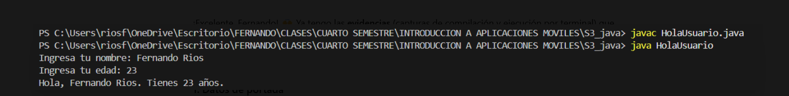
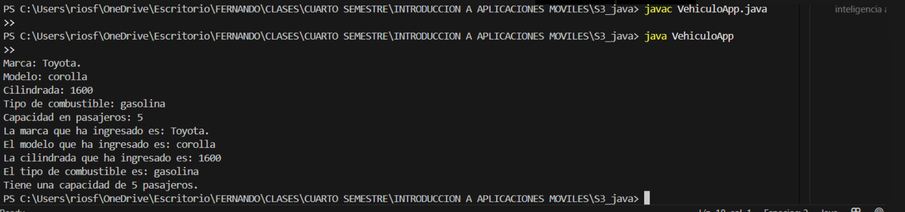

# Actividad S3 – Java por línea de comandos

👤 Autor: Fernando Ríos  
📚 Asignatura: Introducción a Aplicaciones Móviles  
📅 Fecha: (02-09-2025)
👨🏼‍🏫 Docente: Ivan Ayala

## Introducción
Este proyecto consiste en compilar y ejecutar un programa en Java desde la terminal, sin usar un IDE. 
Se trabajó con el código `HolaUsuario.java` y `VehiculoApp.java`.

## Pasos realizados
1. Verifiqué la instalación del JDK con `java -version` y `javac -version`.
2. Creé el archivo `HolaUsuario.java`.
3. Compilé con:
   ```bash
   javac HolaUsuario.java
4. ejecute con:
   java HolaUsuario
5. Como ejercicio adicional, repetí el proceso con VehiculoApp.java.

 

## Código principal: HolaUsuario.java
import java.util.Scanner; // Importa la clase Scanner, que permite leer datos ingresados por el usuario desde consola

public class HolaUsuario { // Declaración de la clase principal llamada HolaUsuario
    public static void main(String[] args) { // Método main: punto de inicio del programa
        Scanner sc = new Scanner(System.in); // Crea un objeto Scanner llamado 'sc' para capturar datos desde la consola

        System.out.print("Ingresa tu nombre: "); // Muestra un mensaje solicitando al usuario que ingrese su nombre
        String nombre = sc.nextLine(); // Lee la línea de texto ingresada por el usuario y la guarda en la variable 'nombre'

        System.out.print("Ingresa tu edad: "); // Solicita al usuario que ingrese su edad
        int edad = Integer.parseInt(sc.nextLine()); // Captura el texto ingresado, lo convierte a número entero y lo asigna a la variable 'edad'

        System.out.println("Hola, " + nombre + ". Tienes " + edad + " años."); 
        // Muestra en pantalla un saludo personalizado con el nombre y la edad ingresados

        sc.close(); // Cierra el objeto Scanner para liberar los recursos que estaba utilizando
    }
}

## Programa adicional: VehiculoApp.java
import java.util.Scanner; // Importa la clase Scanner para leer datos del usuario

public class VehiculoApp { // Declara la clase principal VehiculoApp
    public static void main(String[] args) { // Método main, punto de inicio del programa
        Scanner sc = new Scanner(System.in); // Crea un objeto Scanner para leer datos por consola

        System.out.print("Marca: "); // Muestra mensaje en pantalla
        String marca = sc.nextLine(); // Lee una línea de texto y la guarda en la variable 'marca'

        System.out.print("Modelo: "); 
        String modelo = sc.nextLine(); // Lee el modelo ingresado por el usuario

        System.out.print("Cilindrada: ");
        String cilindrada = sc.nextLine(); // Guarda la cilindrada ingresada

        System.out.print("Tipo de combustible: ");
        String combustible = sc.nextLine(); // Guarda el tipo de combustible ingresado

        System.out.print("Capacidad en pasajeros: ");
        int capacidad = Integer.parseInt(sc.nextLine()); // Convierte el texto ingresado en número entero

        // Salida de datos
        System.out.println("La marca que ha ingresado es: " + marca);
        System.out.println("El modelo que ha ingresado es: " + modelo);
        System.out.println("La cilindrada que ha ingresado es: " + cilindrada);
        System.out.println("El tipo de combustible es: " + combustible);
        System.out.println("Tiene una capacidad de " + capacidad + " pasajeros.");

        sc.close(); // Cierra el objeto Scanner para liberar recursos
    }
}

## Requerimientos Funcionales y No Funcionales

1. Requerimientos funcionales

El sistema debe permitir que el usuario ingrese datos del vehículo (marca, modelo, cilindrada, combustible, pasajeros).

El sistema debe mostrar en pantalla la información ingresada por el usuario.

El sistema debe validar el ingreso de capacidad de pasajeros como número entero.

El sistema debe permitir registrar usuarios mediante cuenta Gmail (futuro alcance).

El sistema debe calcular el costo de despacho de acuerdo con las reglas de negocio.

2. Requerimientos no funcionales

El programa debe ejecutarse en consola, sin necesidad de un IDE.

Debe estar desarrollado en Java (JDK 8 o superior).

Debe ser portable y ejecutarse en cualquier sistema operativo con JVM.

El código debe estar documentado para facilitar su comprensión.

Se debe versionar y documentar en GitHub.


## Historias de Usuario

1. Historia de Usuario 1:
Como cliente de la distribuidora, quiero ingresar los datos de mi vehículo en la aplicación, para poder ver reflejada mi información en pantalla.

2. Historia de Usuario 2:
Como cliente, quiero registrar mi correo Gmail en la aplicación, para poder iniciar sesión y realizar compras de forma segura.

3. Historia de Usuario 3:
Como cliente, quiero que el sistema calcule automáticamente el costo de despacho según mi compra, para saber si tengo envío gratis o cuánto debo pagar.

## Cronograma Inicial
1. Actividad	Responsable	Fecha estimada	Estado
2. Instalación de JDK y configuración	Estudiante	DD/MM/AAAA	Completado
3. Creación de programa HolaUsuario	Estudiante	DD/MM/AAAA	Completado
4. Desarrollo de VehiculoApp	Estudiante	DD/MM/AAAA	Completado
5. Documentación en README.md	Estudiante	DD/MM/AAAA	En proceso
6. Creación de requerimientos	Estudiante	DD/MM/AAAA	Pendiente
7. Historias de usuario	Estudiante	DD/MM/AAAA	Pendiente
8. Cronograma en GitHub Projects	Estudiante	DD/MM/AAAA	Pendiente

## Conclusión
La actividad me permitió comprender el proceso de compilación y ejecución en Java directamente desde la terminal.
Además, al realizar un programa extra pude reforzar el uso de la clase Scanner y el manejo de diferentes tipos de datos.

## Bibliografía

Oracle. (s.f.). The Java™ Tutorials. https://docs.oracle.com/javase/tutorial/

Oracle. (s.f.). JDK Documentation. https://docs.oracle.com/en/java/javase/